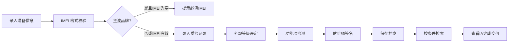

## 1. 产品概述

回收门店设备管理系统，解决纸质记录手机成色、电池健康、拆修史效率低下，历史成交价查询困难的问题。目标用户为门店估价师和管理人员，实现设备档案数字化、质检流程标准化、检索高效化。

## 2. 核心功能

### 2.1 用户角色
| 角色 | 注册方式 | 核心权限 |
|------|----------|----------|
| 估价师 | 系统分配 | 创建设备档案、录入质检记录、查询检索 |
| 管理员 | 系统分配 | 所有权限、数据管理 |

### 2.2 功能模块
1. **设备档案管理**：设备档案 CRUD、软删除、审计字段
2. **质检记录管理**：质检信息录入、外观等级、功能检测、估价师签名
3. **检索查询**：按品牌/成色范围分页检索、历史成交价查询
4. **IMEI 校验**：苹果/华为等主流品牌必填 IMEI 且格式校验

### 2.3 页面详情
| 页面名称 | 模块名称 | 功能描述 |
|----------|----------|----------|
| 设备列表 | 搜索筛选区 | 品牌筛选、成色范围、分页列表 |
| 设备列表 | 数据表格 | 设备基本信息、操作按钮 |
| 设备表单 | 基本信息 | 品牌、型号、IMEI、成色、电池健康、拆修史 |
| 设备表单 | 质检记录 | 日期、外观等级、功能项、估价师签名 |
| 设备详情 | 档案信息 | 完整设备信息展示 |
| 设备详情 | 质检历史 | 所有质检记录时间线 |

## 3. 核心流程

估价师录入新设备 → 填写基本信息（IMEI 校验）→ 录入质检记录 → 提交保存 → 可按条件检索设备 → 查看历史成交价

## 4. 用户界面设计

### 4.1 设计风格
- 主色调：深蓝色 `#1e3a5f`，代表专业可靠
- 辅助色：橙色 `#f59e0b`，用于强调操作
- 按钮风格：圆角 6px，悬停微动画
- 字体："Noto Sans SC" 中文显示字体
- 布局：卡片式布局，顶部导航，侧边筛选

### 4.2 页面设计概述
| 页面名称 | 模块名称 | UI 元素 |
|----------|----------|----------|
| 设备列表 | 搜索区 | 品牌下拉、成色滑块、搜索按钮 |
| 设备列表 | 表格区 | 斑马纹表格、操作列、分页器 |
| 设备表单 | 表单区 | 分组表单、必填星号、实时校验 |
| 设备详情 | 信息卡 | 阴影卡片、标签分组、时间线 |

### 4.3 响应性
桌面端优先设计，适配 1280px 以上屏幕，移动端自适应布局，触控区域优化。
