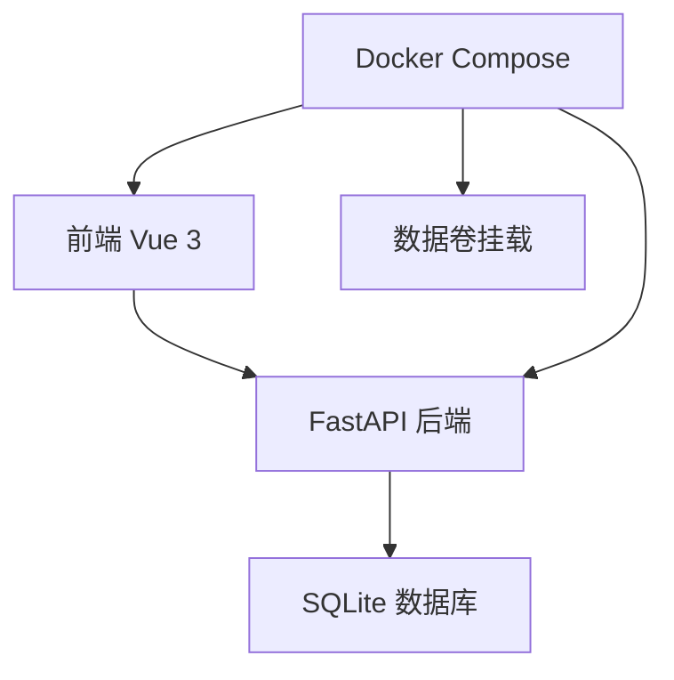
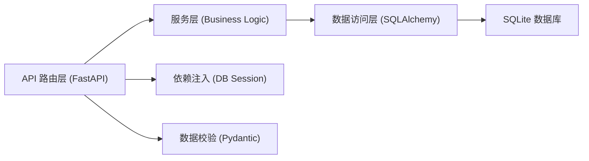
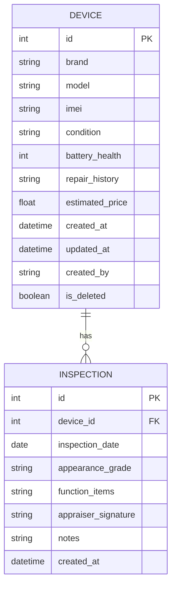

## 1. 架构设计



## 2. 技术描述

- 前端：Vue 3 + TypeScript + Vite + Vue Router + Tailwind CSS
- 后端：FastAPI + Python 3.11 + SQLAlchemy + Pydantic
- 数据库：SQLite（文件型，支持卷挂载持久化）
- 容器化：Docker + Docker Compose

## 3. 路由定义

| 路由 | 用途 |
|------|------|
| / | 设备列表页（默认首页） |
| /devices/new | 新建设备档案 |
| /devices/:id | 设备详情页 |
| /devices/:id/edit | 编辑设备档案 |
| /devices/:id/inspections/new | 新增质检记录 |

## 4. API 定义

### 4.1 设备档案 API

```typescript
interface Device {
  id: number;
  brand: string;
  model: string;
  imei: string | null;
  condition: string;
  battery_health: number;
  repair_history: string;
  estimated_price: number;
  created_at: string;
  updated_at: string;
  created_by: string;
  is_deleted: boolean;
}

// 请求/响应
GET /api/devices?brand=&condition_min=&condition_max=&page=1&page_size=20
  -> { items: Device[], total: number, page: number, page_size: number }

GET /api/devices/:id -> Device

POST /api/devices -> Device
Body: { brand, model, imei?, condition, battery_health, repair_history, estimated_price }

PUT /api/devices/:id -> Device
Body: { brand, model, imei?, condition, battery_health, repair_history, estimated_price }

DELETE /api/devices/:id -> { success: boolean }
```

### 4.2 质检记录 API

```typescript
interface Inspection {
  id: number;
  device_id: number;
  inspection_date: string;
  appearance_grade: string;
  function_items: string[];
  appraiser_signature: string;
  notes: string;
  created_at: string;
}

GET /api/devices/:id/inspections -> Inspection[]
POST /api/devices/:id/inspections -> Inspection
DELETE /api/inspections/:id -> { success: boolean }
```

## 5. 服务器架构图



## 6. 数据模型

### 6.1 数据模型定义



### 6.2 数据定义语言

```sql
-- 设备档案表
CREATE TABLE devices (
    id INTEGER PRIMARY KEY AUTOINCREMENT,
    brand VARCHAR(50) NOT NULL,
    model VARCHAR(100) NOT NULL,
    imei VARCHAR(15),
    condition VARCHAR(20) NOT NULL,
    battery_health INTEGER CHECK (battery_health BETWEEN 0 AND 100),
    repair_history TEXT,
    estimated_price DECIMAL(10,2),
    created_at DATETIME DEFAULT CURRENT_TIMESTAMP,
    updated_at DATETIME DEFAULT CURRENT_TIMESTAMP,
    created_by VARCHAR(50) DEFAULT 'system',
    is_deleted BOOLEAN DEFAULT 0
);

CREATE INDEX idx_devices_brand ON devices(brand);
CREATE INDEX idx_devices_condition ON devices(condition);
CREATE INDEX idx_devices_is_deleted ON devices(is_deleted);

-- 质检记录表
CREATE TABLE inspections (
    id INTEGER PRIMARY KEY AUTOINCREMENT,
    device_id INTEGER NOT NULL,
    inspection_date DATE NOT NULL,
    appearance_grade VARCHAR(10) NOT NULL,
    function_items TEXT,
    appraiser_signature VARCHAR(100) NOT NULL,
    notes TEXT,
    created_at DATETIME DEFAULT CURRENT_TIMESTAMP,
    FOREIGN KEY (device_id) REFERENCES devices(id)
);

CREATE INDEX idx_inspections_device_id ON inspections(device_id);
CREATE INDEX idx_inspections_date ON inspections(inspection_date);
```
