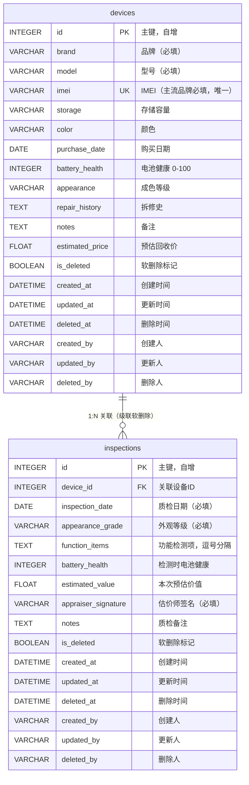

# 回收门店设备管理系统

> 告别纸质本，设备档案、质检记录、历史成交价一键可查。

## 技术栈

| 层级 | 技术 | 说明 |
|------|------|------|
| 前端 | Vue 3 + TypeScript + Vite + Tailwind CSS | 响应式界面，组件化开发 |
| 后端 | FastAPI + SQLAlchemy 2.0 + Pydantic 2.x | 高性能异步 API，自动生成 OpenAPI 文档 |
| 数据库 | SQLite 3 | 轻量级文件数据库，支持卷挂载持久化 |
| 部署 | Docker Compose + Nginx | 一键启动前后端 |

---

## 快速开始

### 方式一：Docker Compose（推荐）

```bash
# 一键启动所有服务
docker-compose up -d --build

# 查看服务状态
docker-compose ps

# 查看日志
docker-compose logs -f backend
docker-compose logs -f frontend

# 停止服务
docker-compose down
```

启动完成后访问：

| 服务 | 地址 |
|------|------|
| 前端界面 | http://localhost:3000 |
| 后端 API 文档 | http://localhost:8000/docs 或 http://localhost:3000/docs |
| OpenAPI JSON | http://localhost:8000/openapi.json |

### 方式二：本地开发

**后端：**

```bash
cd backend
pip install -r requirements.txt
cp .env.example .env
uvicorn app.main:app --host 0.0.0.0 --port 8000 --reload
```

**前端：**

```bash
npm install
npm run dev
```

前端地址：http://localhost:5173（已配置 API 代理到后端 8000 端口）

---

## 核心功能

### 1. 设备档案 CRUD

- 录入设备基础信息：品牌、型号、IMEI、存储、颜色、购买日期
- 成色评估：全新 / 99新 / 95新 / 9成新 / 8成新 / 7成新及以下
- 电池健康、拆修史、预估回收价等关键信息
- **软删除机制**：删除时保留审计字段（`is_deleted`、`deleted_at`、`deleted_by`），数据可追溯

### 2. 质检记录

- 每次质检独立记录：日期、外观等级、功能检测项
- 15 项标准功能检测（屏幕、触摸、通话、摄像头、扬声器等）
- 电池健康复测、预估价值
- **估价师签名**：记录责任人
- 一台设备可有多条质检记录，支持历史对比

### 3. 高级检索

| 检索维度 | 说明 |
|----------|------|
| 品牌筛选 | 精准匹配 10 大主流品牌 + 其他 |
| 成色范围 | 按最低 / 最高成色区间过滤 |
| 关键词搜索 | 型号模糊搜索 + IMEI 精确匹配 |
| 分页浏览 | 支持自定义页大小，页码跳转 |

### 4. IMEI 智能校验

- **主流品牌强制要求**：苹果 / 华为 / 小米 / OPPO / vivo / 三星 / 荣耀 / 一加 / realme / 魅族
- **前端校验**：输入时自动格式化、Luhn 算法校验
- **后端校验**：双重校验确保数据准确
- **唯一性约束**：IMEI 全局唯一，防止重复录入

---

## 数据库 ER 图



**表说明：**

- `devices`：设备主表，一台设备一条记录
- `inspections`：质检记录表，一台设备可对应多条质检
- 两表均含软删除字段和审计字段，删除操作仅标记 `is_deleted=True`

---

## API 接口清单

> 所有接口前缀：`/api/v1`
>
> 完整交互式文档：启动后访问 `/docs`（Swagger UI）或 `/redoc`

### 一、设备档案

| 方法 | 路径 | 说明 | 请求体 / 参数 |
|------|------|------|---------------|
| `GET` | `/devices` | 分页查询设备列表 | Query: `page`, `page_size`, `brand`, `appearance_min`, `appearance_max`, `keyword` |
| `GET` | `/devices/{id}` | 获取单台设备详情（含质检记录） | Path: `id` |
| `POST` | `/devices` | 创建设备档案 | Body: [DeviceCreate](#schemas) |
| `PUT` | `/devices/{id}` | 更新设备档案 | Path: `id`, Body: [DeviceUpdate](#schemas) |
| `DELETE` | `/devices/{id}` | 软删除设备（级联删除其质检记录） | Path: `id` |

**查询示例：**

```
GET /api/v1/devices?page=1&page_size=10&brand=苹果&appearance_min=95新&keyword=iPhone 15
```

**分页响应：**

```json
{
  "total": 128,
  "page": 1,
  "page_size": 10,
  "pages": 13,
  "items": [
    {
      "id": 1,
      "brand": "苹果",
      "model": "iPhone 15 Pro",
      "imei": "123456789012345",
      "appearance": "99新",
      "estimated_price": 6500,
      "inspection_count": 2
    }
  ]
}
```

### 二、质检记录

| 方法 | 路径 | 说明 | 请求体 / 参数 |
|------|------|------|---------------|
| `GET` | `/inspections` | 查询质检记录列表 | Query: `device_id`（可选，按设备过滤） |
| `GET` | `/inspections/{id}` | 获取单条质检详情 | Path: `id` |
| `POST` | `/inspections` | 创建质检记录 | Body: [InspectionCreate](#schemas) |
| `PUT` | `/inspections/{id}` | 更新质检记录 | Path: `id`, Body: [InspectionUpdate](#schemas) |
| `DELETE` | `/inspections/{id}` | 软删除质检记录 | Path: `id` |

### 三、元数据

| 方法 | 路径 | 说明 |
|------|------|------|
| `GET` | `/metadata` | 获取品牌列表、成色选项、功能检测项清单 |

---

## 数据模型 Schemas

### DeviceCreate（创建设备）

```json
{
  "brand": "苹果",
  "model": "iPhone 15 Pro",
  "imei": "123456789012345",
  "storage": "256GB",
  "color": "远峰蓝",
  "purchase_date": "2024-01-15",
  "battery_health": 96,
  "appearance": "99新",
  "repair_history": "无拆修",
  "notes": "原装配件齐全",
  "estimated_price": 6500
}
```

### InspectionCreate（创建质检）

```json
{
  "device_id": 1,
  "inspection_date": "2024-06-15",
  "appearance_grade": "99新",
  "function_items": "屏幕显示,触摸功能,通话功能,摄像头,扬声器,WIFI,蓝牙",
  "battery_health": 95,
  "estimated_value": 6300,
  "appraiser_signature": "张估价师",
  "notes": "底部有轻微划痕，功能全部正常"
}
```

---

## 项目目录结构

```
tl-0043-1/
├── backend/                      # FastAPI 后端
│   ├── app/
│   │   ├── routers/
│   │   │   ├── devices.py        # 设备档案 API 路由
│   │   │   └── inspections.py    # 质检记录 API 路由
│   │   ├── database.py           # SQLAlchemy 连接配置
│   │   ├── models.py             # ORM 数据模型
│   │   ├── schemas.py            # Pydantic 请求/响应模型
│   │   ├── validators.py         # IMEI 校验等工具
│   │   └── main.py               # FastAPI 应用入口
│   ├── data/                     # SQLite 数据目录（自动创建）
│   ├── Dockerfile                # 后端 Docker 构建
│   ├── requirements.txt          # Python 依赖
│   └── .env.example              # 环境变量示例
│
├── src/                          # Vue 3 前端源码
│   ├── components/
│   │   ├── DeviceForm.vue        # 设备新增/编辑表单
│   │   ├── DeviceDetail.vue      # 设备详情抽屉（含质检管理）
│   │   └── InspectionForm.vue    # 质检记录表单
│   ├── pages/
│   │   └── HomePage.vue          # 主页面：列表、搜索、分页
│   ├── types/
│   │   └── index.ts              # TypeScript 类型定义
│   ├── lib/
│   │   ├── api.ts                # Axios API 封装
│   │   └── utils.ts
│   └── router/index.ts
│
├── docker-compose.yml            # 一键部署配置
├── Dockerfile.frontend           # 前端 Docker 构建
├── nginx.conf                    # Nginx 反代配置
└── README.md
```

---

## 审计说明

所有表包含 6 个审计字段：

| 字段 | 触发时机 | 说明 |
|------|----------|------|
| `created_at` | 创建时 | 时间戳 |
| `created_by` | 创建时 | 操作人 |
| `updated_at` | 更新时 | 时间戳 |
| `updated_by` | 更新时 | 操作人 |
| `deleted_at` | 删除时 | 时间戳（软删除） |
| `deleted_by` | 删除时 | 操作人（软删除） |
| `is_deleted` | 删除时 | 布尔标记（默认 `False`） |

> 💡 实际生产环境中，`*_by` 字段应从 JWT Token 或 Session 中获取当前登录用户。当前版本使用默认值 `admin`，便于演示。

---

## 常见问题

**Q：如何重置数据库？**

```bash
# Docker 方式
docker-compose down -v        # -v 会删除 db_data 卷
docker-compose up -d --build  # 重新创建

# 本地方式
rm -f backend/data/devices.db
```

**Q：支持哪些主流品牌的 IMEI 校验？**

10 大品牌：苹果、华为、小米、OPPO、vivo、三星、荣耀、一加、realme、魅族

**Q：IMEI 校验用了什么算法？**

Luhn 算法（模 10 校验），国际通用的 IMEI 数字校验标准。

---

## License

内部项目 © 回收门店
